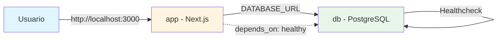

# Tarea 6 - Sistema de Reportes con Data Warehouse

Este proyecto despliega una aplicación web construida con Next.js que consume vistas dinámicas de una base de datos PostgreSQL, optimizada mediante índices y roles de seguridad.

## 🚀 Características Principales

- ✅ **Seguridad mejorada**: Variables de entorno, roles de DB con permisos limitados, usuario NO-ROOT en Docker
- ✅ **Optimizado para producción**: Multi-stage Docker build, output standalone de Next.js
- ✅ **Arquitectura separada**: Frontend y base de datos en carpetas independientes
- ✅ **Healthcheck integrado**: Verificación automática de disponibilidad de PostgreSQL
- ✅ **Puerto restringido**: PostgreSQL solo accesible desde localhost

## 📋 Requisitos Previos

- **Docker Desktop** instalado y **en ejecución**
- Git (para clonar el repositorio)

## 🔧 Instalación y Configuración

### 1. Clonar el repositorio

```bash
git clone https://github.com/Moraaa4/tarea-6.git
cd tarea-6
```

### 2. Configurar variables de entorno

Crea un archivo `.env` en la raíz del proyecto basándote en el archivo `.env.example`:

```bash
cp .env.example .env
```

Luego edita el archivo `.env` y completa **todos** los valores necesarios:

```env
# PostgreSQL Admin User Configuration
POSTGRES_USER=your_postgres_admin
POSTGRES_PASSWORD=your_secure_password
POSTGRES_DB=your_database_name

# Web Application Database User Password
WEB_USER_PASSWORD=your_web_user_password

# Application Connection String
# El formato debe ser: postgres://web_dashboard_user:password@db:5432/database_name
DATABASE_URL=postgres://web_dashboard_user:your_web_user_password@db:5432/your_database_name

### 3. Ejecutar el proyecto

```bash
# Detener servicios y limpiar volúmenes (si ya estaban corriendo)
docker-compose down -v

# Construir y levantar servicios
docker-compose up --build
```

> **💡 Tip**: Si quieres ejecutar en segundo plano (detached mode):
> ```bash
> docker-compose up -d --build
> docker-compose logs -f  # Ver logs
> ```

La aplicación estará disponible en: **http://localhost:3000**

## 📁 Estructura del Proyecto

```
tarea-6/
├── frontend/                    # 🎨 Aplicación Next.js
│   ├── src/                    # Páginas y componentes React
│   │   └── app/               # App router de Next.js
│   ├── lib/                    # Utilidades y conexión a DB
│   ├── public/                 # Archivos estáticos
│   ├── Dockerfile              # Build multi-stage optimizado
│   ├── .dockerignore           # Excluye archivos sensibles
│   ├── package.json            # Dependencias del frontend
│   ├── tsconfig.json           # Configuración TypeScript
│   ├── tailwind.config.ts      # Configuración Tailwind CSS
│   └── next.config.ts          # Configuración Next.js
├── db/                          # 🗄️ Scripts de base de datos
│   ├── 01_schema.sql           # Esquema de tablas
│   ├── 02_seed.sql             # Datos de prueba
│   ├── 03_reports_vw.sql       # Vistas de reportes
│   ├── 04_indexes.sql          # Índices para optimización
│   ├── 05_roles.sql            # Roles y permisos
│   └── 06_set_passwords.sh     # Script de contraseñas seguras
├── .env                         # Variables de entorno (NO en repo)
├── .env.example                 # Plantilla de variables
├── .gitignore                   # Archivos ignorados
├── docker-compose.yml           # Orquestación de servicios
└── README.md                    # Este archivo
```

## 🛠️ Tecnologías Utilizadas

| Tecnología | Versión | Propósito |
|------------|---------|-----------|
| **Next.js** | 15 | Framework de React para aplicaciones web |
| **TypeScript** | - | Tipado estático para JavaScript |
| **PostgreSQL** | 15 | Base de datos relacional |
| **Docker** | - | Contenedorización de servicios |
| **Tailwind CSS** | - | Framework de estilos utility-first |
| **Node.js** | 20 | Runtime de JavaScript |

## 📊 Funcionalidades

El sistema incluye **5 reportes dinámicos** que consumen vistas optimizadas de la base de datos:

1. 📈 **Ventas por Categoría** - Análisis de ventas agrupadas por categoría de producto
2. 🏆 **Ranking de Clientes** - Clientes ordenados por volumen de compras
3. ⚠️ **Stock en Alerta** - Productos con inventario bajo que requieren reabastecimiento
4. 📅 **Ventas Mensuales** - Tendencias de ventas agregadas por mes
5. 📋 **Monitor de Estatus** - Estado general de pedidos y productos en tiempo real

## 🔒 Seguridad

### Medidas Implementadas

- ✅ **Variables de entorno**: Todas las credenciales están externalizadas en `.env`
- ✅ **Roles de PostgreSQL**: Usuario `web_dashboard_user` con permisos **solo de lectura** (SELECT)
- ✅ **Contraseñas seguras**: Establecidas mediante scripts que leen variables de entorno
- ✅ **Usuario sin privilegios**: La aplicación Docker corre como usuario `nextjs` (NO root)
- ✅ **Puerto restringido**: PostgreSQL solo accesible desde `127.0.0.1` (localhost)
- ✅ **.dockerignore**: Archivos sensibles (`.env`) nunca se copian a la imagen
- ✅ **Consultas parametrizadas**: Protección contra inyecciones SQL
- ✅ **Build optimizado**: Multi-stage build reduce superficie de ataque

### Roles de Base de Datos

| Rol | Permisos | Propósito |
|-----|----------|-----------|
| `POSTGRES_USER` | Admin completo | Administración de la base de datos |
| `web_dashboard_user` | SELECT only | Usuario de la aplicación web (solo lectura) |

## 🐳 Servicios Docker

El proyecto utiliza **2 servicios orquestados**:

### **db** - PostgreSQL 15
- **Imagen**: `postgres:15`
- **Puerto**: `127.0.0.1:5432:5432` (solo localhost)
- **Healthcheck**: Verifica disponibilidad cada 5 segundos
- **Inicialización**: Scripts SQL ejecutados automáticamente desde `/db`

### **app** - Next.js Application
- **Build**: Multi-stage optimizado desde `./frontend`
- **Puerto**: `3000:3000`
- **Dependencia**: Espera a que `db` esté `healthy` antes de iniciar
- **Usuario**: Corre como `nextjs` (UID 1001, sin privilegios)



## 🧪 Comandos Útiles

```bash
# Ver estado de los servicios
docker-compose ps

# Ver logs de un servicio específico
docker-compose logs app
docker-compose logs db

# Ver logs en tiempo real
docker-compose logs -f

# Detener servicios (mantiene volúmenes)
docker-compose down

# Detener y eliminar volúmenes (borra datos de DB)
docker-compose down -v

# Reiniciar servicios
docker-compose restart

# Reconstruir imagen
docker-compose up --build

# Acceder a la base de datos
docker-compose exec db psql -U admin_user -d tienda_db

# Ver roles de PostgreSQL
docker-compose exec db psql -U admin_user -d tienda_db -c "\du"
```

## 🐛 Solución de Problemas

### Error: "Cannot connect to the Docker daemon"
**Solución**: Asegúrate de que Docker Desktop está corriendo.

### Error: "port is already allocated"
**Solución**: Otro servicio está usando el puerto 3000 o 5432. Detén el servicio o cambia el puerto en `docker-compose.yml`.

### Error: "database connection refused"
**Solución**: 
1. Verifica que el servicio `db` tiene estado `healthy`: `docker-compose ps`
2. Revisa que `DATABASE_URL` en `.env` sea correcta
3. Verifica logs: `docker-compose logs db`

### La aplicación no carga datos
**Solución**:
1. Verifica que los scripts SQL se ejecutaron: `docker-compose logs db | grep "PostgreSQL init"`
2. Conéctate a la DB y verifica datos: `docker-compose exec db psql -U admin_user -d tienda_db -c "SELECT COUNT(*) FROM productos;"`

## 📝 Notas Adicionales

- 🔄 **Reinicialización de datos**: Los datos se recrean automáticamente desde `02_seed.sql` al eliminar volúmenes
- 🔐 **Primera ejecución**: El script `06_set_passwords.sh` establece la contraseña del usuario `web_dashboard_user`
- 📦 **Producción**: El Dockerfile usa `output: 'standalone'` para generar un bundle optimizado
- 🚀 **Rendimiento**: Los índices en `04_indexes.sql` optimizan las consultas de las vistas

## 🔄 Actualización desde Versión Anterior

Si ya tenías una versión anterior del proyecto:

```bash
# 1. Detener y eliminar contenedores y volúmenes
docker-compose down -v

# 2. Actualizar .env con las nuevas variables
# Agregar: POSTGRES_USER y WEB_USER_PASSWORD

# 3. Reconstruir y levantar servicios
docker-compose up --build
```

## 👤 Autor

**Fernando Mora Mercado**

---